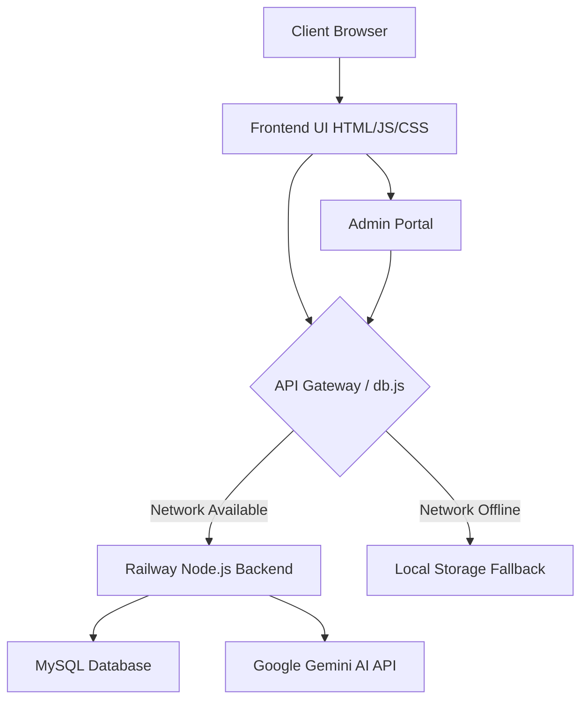

# Roshani Technologies - Smart Digital Academy Report

## Executive Summary
Roshani Technologies is a state-of-the-art educational platform designed to provide courses in Architecture, Engineering, and Construction (AEC) software, including BIM, CAD, and rendering tools. The platform is designed with a modern, glassmorphic UI, robust local-first authentication, and AI-powered assistance.

## System Architecture Diagram

## Section-Wise Breakdown

### 1. Homepage & Core Navigation
The homepage features a dynamic, animated hero section that welcomes students to the academy. It uses a sleek dark/light mode toggle and provides quick access to core features such as course listings, leadership profiles, and contact forms.

### 2. All Courses
The course catalog lists extensive training programs ranging from Autodesk AutoCAD and Revit to Civil 3D and Primavera. The platform dynamically renders course cards with detailed syllabus information.

### 3. tech AI Workspace (Gemini Chatbot)
The website includes a dedicated AI assistant powered by Google's Gemini models. It provides instant answers to student queries regarding course details, fees, placements, and timings. The AI workspace operates seamlessly via the Node.js backend.

### 4. Admin Dashboard
A secure administrative portal allows academy managers to review new student leads, monitor registered users, and track daily engagement metrics. It syncs with both the MySQL backend and local storage, ensuring data is never lost even during offline states.

## Conclusion
The Roshani Technologies digital platform stands out as a highly resilient, modern web application. By incorporating offline-first data synchronization (via `db.js`), premium UI aesthetics (Tailwind CSS glassmorphism), and cutting-edge AI support, it delivers an unparalleled experience for engineering design students.
