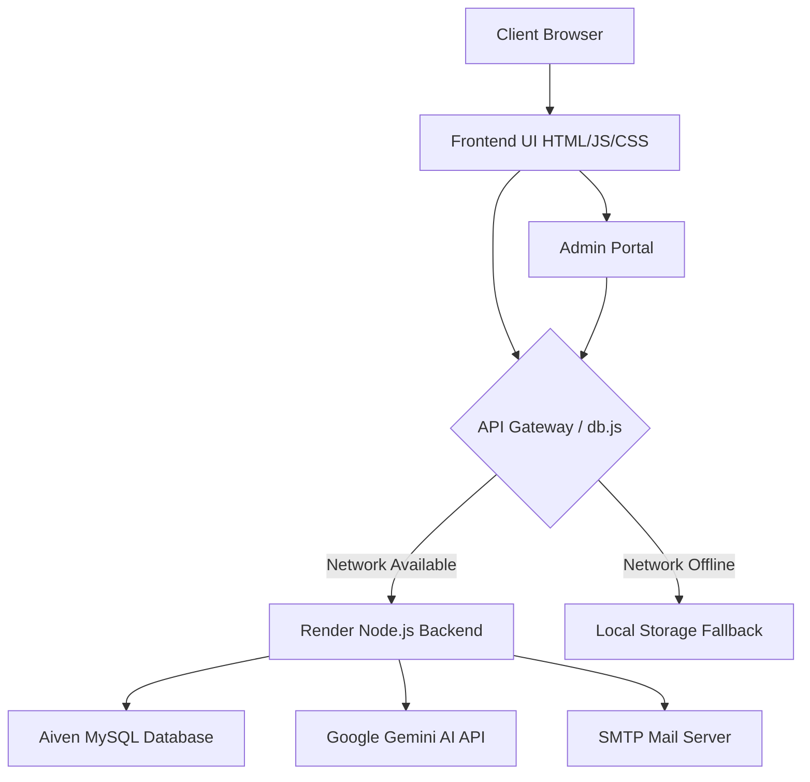
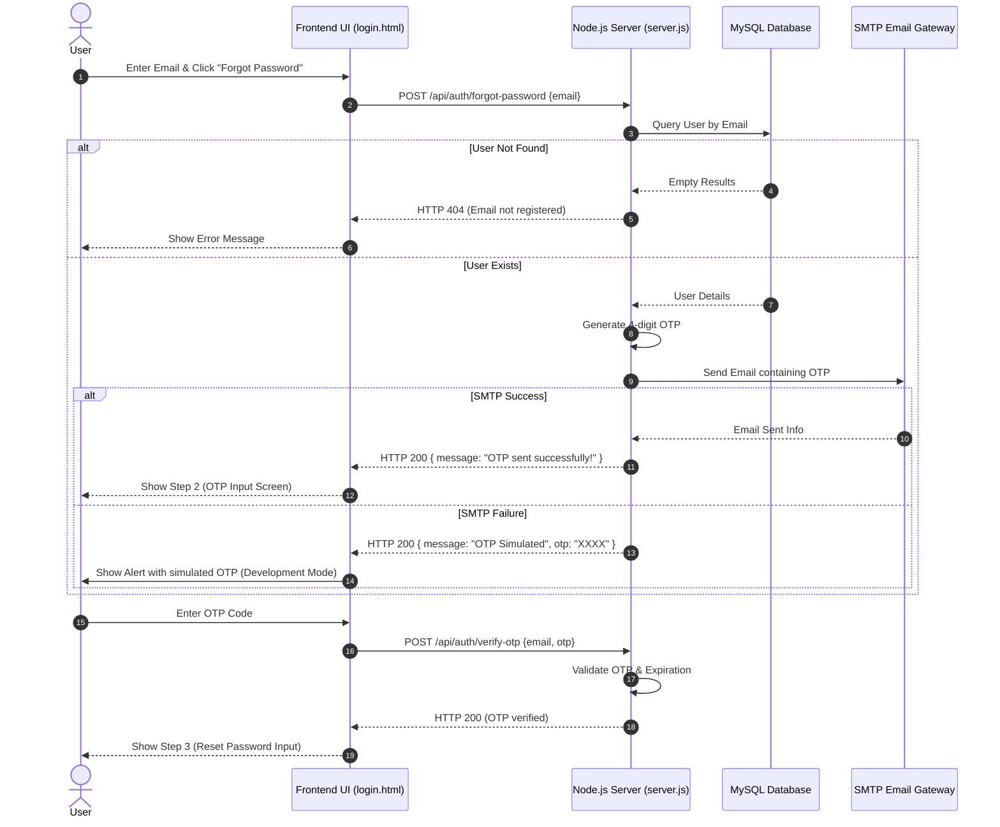

# Roshani Technologies - Smart Digital Academy Report

## Executive Summary
Roshani Technologies is a state-of-the-art educational platform designed to provide courses in Architecture, Engineering, and Construction (AEC) software, including BIM, CAD, and rendering tools. The platform is designed with a modern, glassmorphic UI, robust local-first authentication, SMTP-driven OTP password resets, and AI-powered assistance. Recent updates have greatly enhanced the site's professional aesthetics, trust indicators, content structure, and user accessibility.

## Architecture & Process Diagrams

### 1. System Architecture Diagram

### 2. Password Reset OTP Flow (Sequence Diagram)

---

## Key Platform Features & Recent Enhancements

### 1. Re-designed Hero & Trust Accreditations
The homepage features a dynamic, animated hero section with clarified services and double CTAs ("Explore Courses →" and "Book Free Demo"). Right below the Hero section, a premium Trust & Accreditations row is integrated showing official partner status badges (Autodesk ATC, Bentley Partner, Graphisoft Partner, Lumion Partner, Trimble Authorized, Chaos, and Unity Academic).

### 2. Verified Corporate Statistics
A credentials counter section presents official and verified metrics to build confidence:
- **40+ Years** Experience
- **1M+** Professionals Trained
- **100+** Certified Courses
- **500+** Corporate Clients
- **50+** Certified Trainers

### 3. Categorized Course Catalog & Dynamic Filtering
To clean up navigation, courses are grouped into five distinct engineering categories with interactive filter tabs. Standardized duration badges (e.g. 40 Hours, 80 Hours, 120 Hours) and specific value-adds (✔ Beginner Friendly, ✔ Autodesk Certified Trainers, etc.) have been integrated on all 12 cards.

### 4. Fully Expanded Legal & Corporate Footer
All website pages feature a restructured footer layout containing a dedicated **Legal & Verification** directory with links to Privacy Policy, Terms & Conditions, Refund Policy, Student Verification, Certificate Verification, and Sitemap.

### 5. Email OTP Password Reset Flow
The authentication system integrates a robust OTP-based password reset module. If the SMTP gateway fails, the frontend displays a simulated OTP warning pop-up on the screen, ensuring developer testing and users are never stuck.

---

## Conclusion
By incorporating offline-first data synchronization (via `db.js`), premium UI aesthetics (Tailwind CSS glassmorphism), verified accreditations, and robust email verification systems, the Roshani Technologies platform offers an extremely resilient, modern, and trustworthy educational experience.
